# ON THE TOPIC OF BIOMTETRICS

# 1. OVERVIEW

## 1.1 Authentication:

- Knowledge factors. A knowledge factor is something you know, such as a username and password.
- Possession factors. A possession factor is something you have, such as a smart card or a security token.
- Inherence factors. An inherence factor is something you are.

## 1.2 Securities system and the rise in demands of biometrics:

- Modern system often implements a combination of the above mentioned authentication factors.
- Demands in state-of-the-art biometrics solutions are increasing, due to the following reasons:
    1. Increasing demand for automation
    2. Increasing demand for security and surveillance
    3. Increasing incidents of crimes, e.g., fraud and phishing 
    4. Technology development
    5. Covid 19

# 2. INTRO TO BIOMETRICS

## 2.1 What is biometrics:

- A measurable physical characteristic or personal behavioral trait used to recognize the identity, or verify the claimed identity, of an applicant.

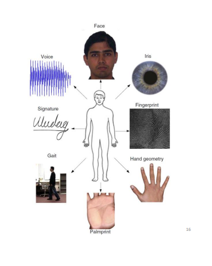
- Biometrics is often divided into 2 categories:
    1. Physical
    2. Behavioral

## 2.2 Biometrics systems:
- Biometric systems are using biometrics to authenticate or identify a person. A system 
collects biometric characteristics unique to every person. These biometric characteristics are then directly linked to verify or identify the individual. Two phases:    
    1. Biometric enrollment
    2. Recognition 

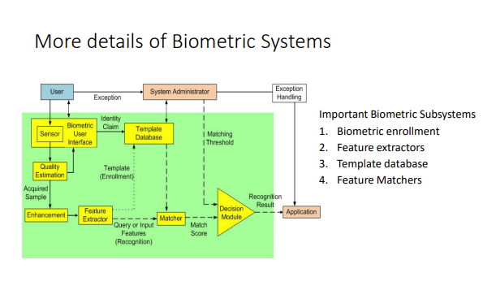

> ![NOTE] Feature extraction:
> - Preprocessing:
> 1. Quality assessment
> 2. Segmentation
> 3. enhancement
> - Feature extraction:
> 1. Compact but expressive representation of biometric samples
> 2. Biometric traits

- Types of biometrics recognition:
    1. Verification or Authentication: 
        - "Are you who you said you are?"

    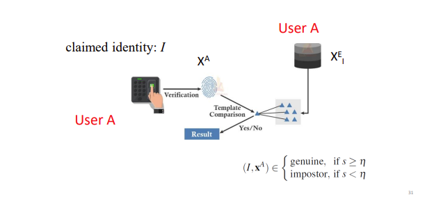

    2. Identification: 
        - Identification can be further classified into positive and negative identification by the questions:
        - “Are you someone who is known to the system?" or  “Are you who you say you are not?”
        - Types of identification:
    
    - Open set:

    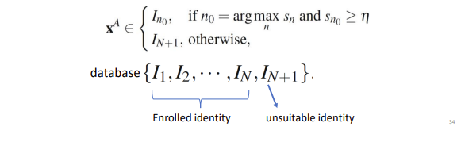

    - Closed set: the output identity is known

    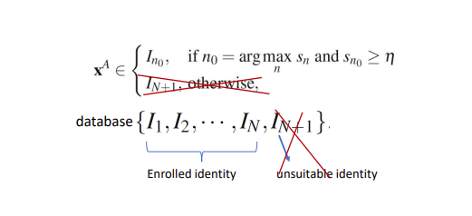

- Science of biometric recognition is based on two fundamental premises with a biometric trait:
    1. Uniqueness
    2. Permanence
- However, these two premises are seldom true, because:
    1. Physical trait may not be unique
    2. Biometrics may change overtime

- Intra-user variations (or intra-class variations). This is due to reasons:
    1. Imperfect sensing conditions (eg., noise, system errors)
    2. Alteration in biometric characteristics
    3. Changes in ambient conditions (eg., inconsistent illumination)
    4. Variations in the interaction with the sensor,….

- Measuring a model's performance:
    - In biometric verification, there are two popular metrics 
        1. False Rejection Rate (FRR) and False Acceptance Rate (FAR), also
        2. False Non-match Rate (FNMR) and False Match Rate (FMR)

Which are computed based on the genuine and imposter match score 
distribution

# 3. FINGERPRINT

## 3.1: Introduction:

- A typical young male has, on an average, 20.7 ridges/cm2
- While a female has 23.4 ridges /cm2
- Biometric characteristics
    1. Unique (even for twins)
    2. Immutable

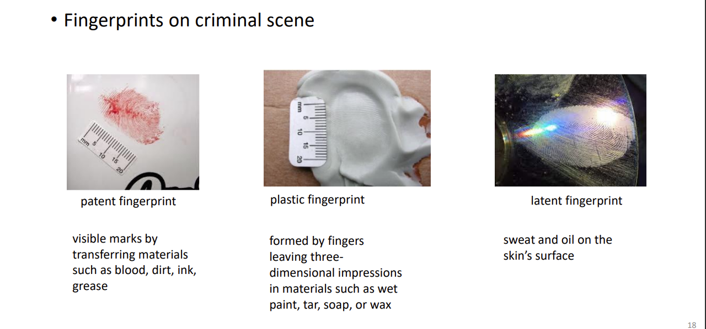

- Most fingerprint recognition method are feature-based, with feature levels from coarse to fine.

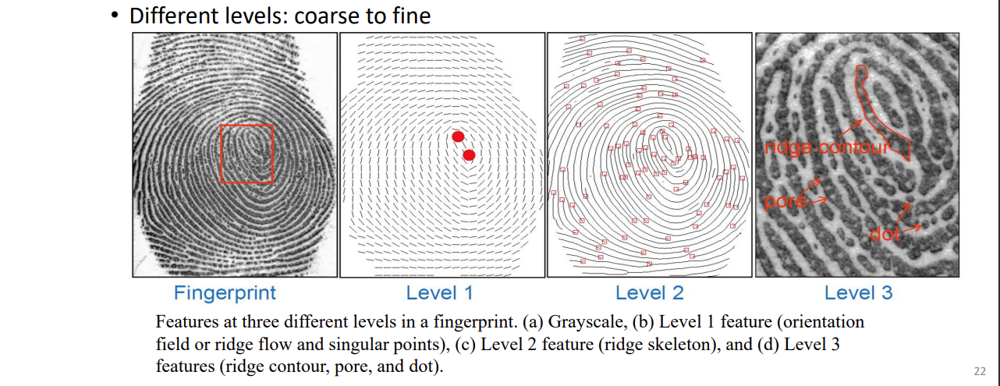

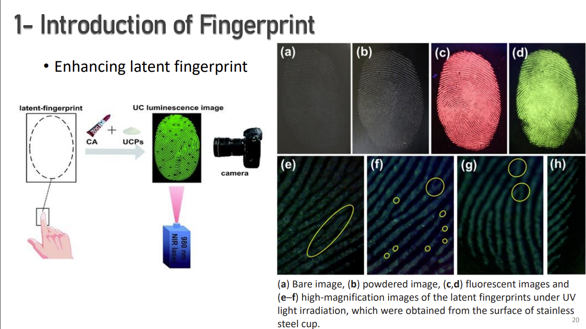

## 3.2. Fingerprint features:

1. Level 1 features:
    -  Ridge orientation map 
    - Local ridge frequency (density)
    - Salient locations where ridge orientation change abruptly

    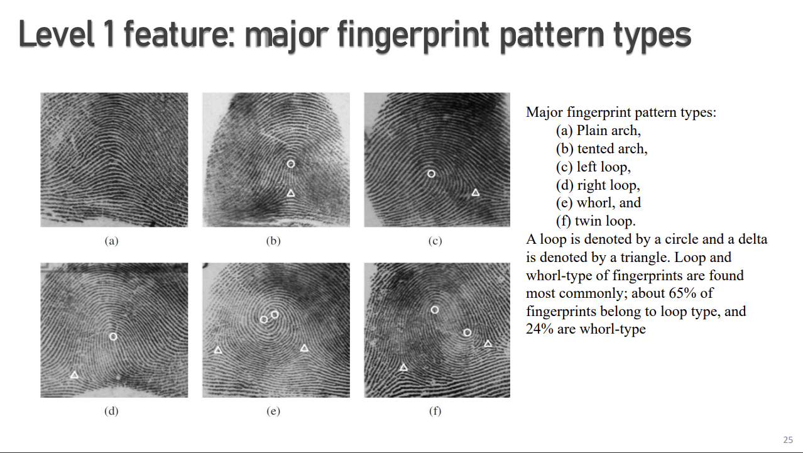

2. Level 2 features:
    - Ridges at this level are represented as skeletons
    - Geometric and dimensional details are ignored!
    - Minutiae (ridge characteristics) is where ridges emerges, ends, splits, or merges:

    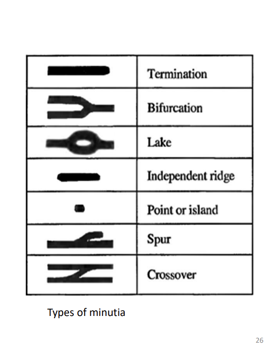

    - Feature map in level 2:
        1. Location
        2. Direction
        3. Type

3. Level 3 features (only visible at high resolution):

    - Inner holes (pores)
    - Dot: very short ridge
    - Incipient ridge: immature thin ridge

    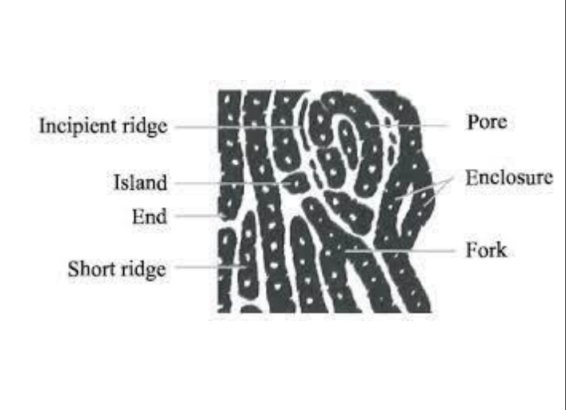

4. Other features (not universal):

    - Scars
    - Creases
    - Cuts
    ...

## 3.3. Obtaining fingerprint images:

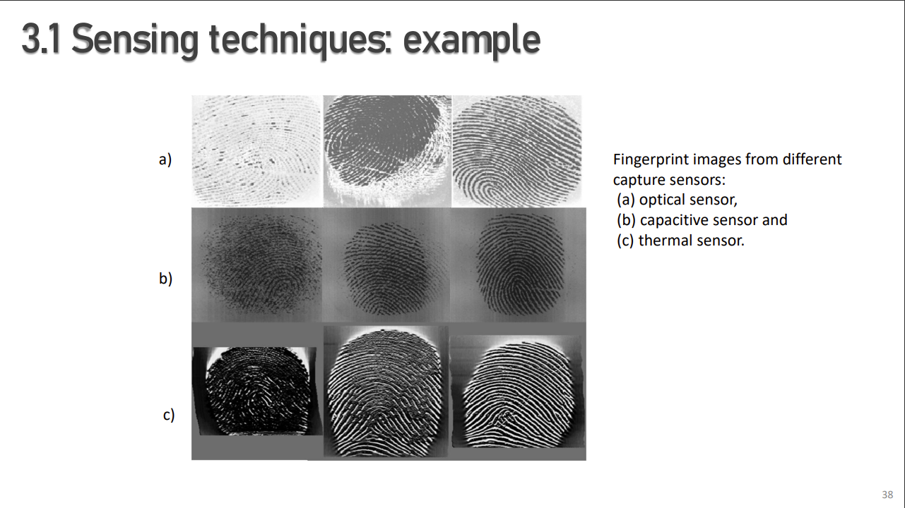

- Images criteria:   
    1. Resolution: more than 500ppi
    2. Finger area
    3. clarity of ridge pattern

## 3.4 Feature extraction:

## 3.5. Matching:

- Almost all system implements minutiae matching, using a score and threshold grading.
- Hough transform is used to mapped the query minutae into the template minutae to calculate matching score.

# 4. IRIS

## 4.1. Introduction:

- Ocular region of human face includes the eyes, eyebrows, nose bridge, and facial skin. The iris is 
the colored structure located in the annular region of the eye

- Iris recognition is widely considered to be the most accurate modality of 
biometric identification

- **History** of the iris biometric:
    
        The concept of Iris Recognition was first proposed by Dr. Frank Burch in 1939. 
        It was first implemented in 1990 when Dr. John Daugman created the algorithms for it. 
        These algorithms employ methods of pattern recognition and some mathematical calculations for 
        iris recognition.

- Iris recognition diagram:

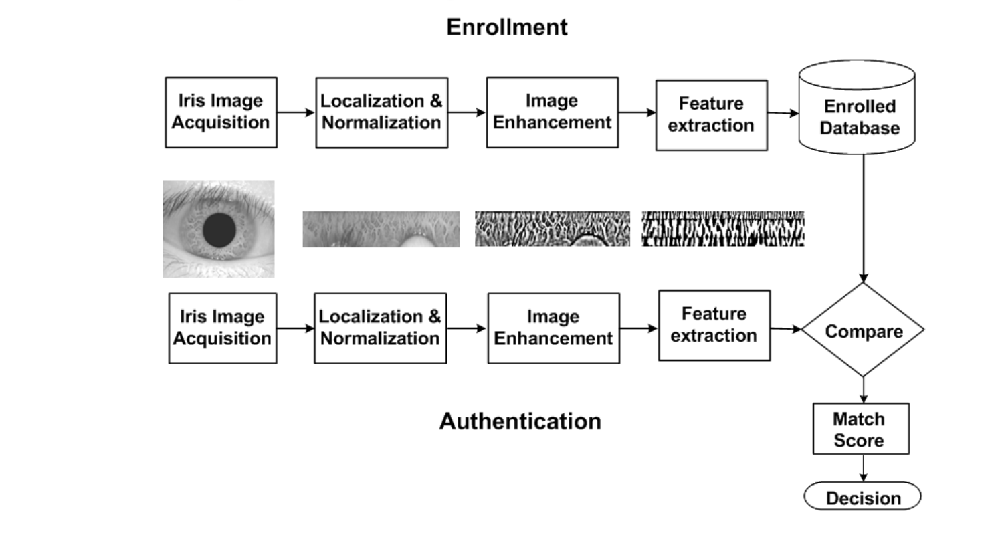

## 4.2. Features:

- Pupil
- Collarette
- Crypts and Furrows

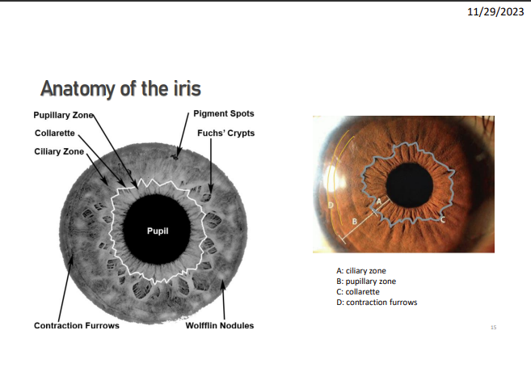

## 4.3. Obtaining iris images:

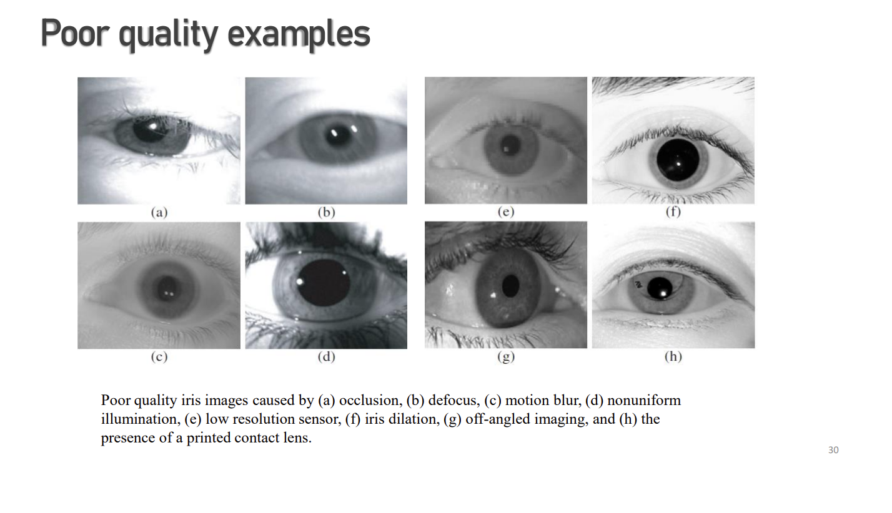

- (a) occlusion 
- (b) defocus 
- (c) motion blur 
- (d) nonuniform illumination 
- (e) low resolution sensor 
- (f) iris dilation 
- (g) off-angled imaging 
- (h) the presence of a printed contact lens.

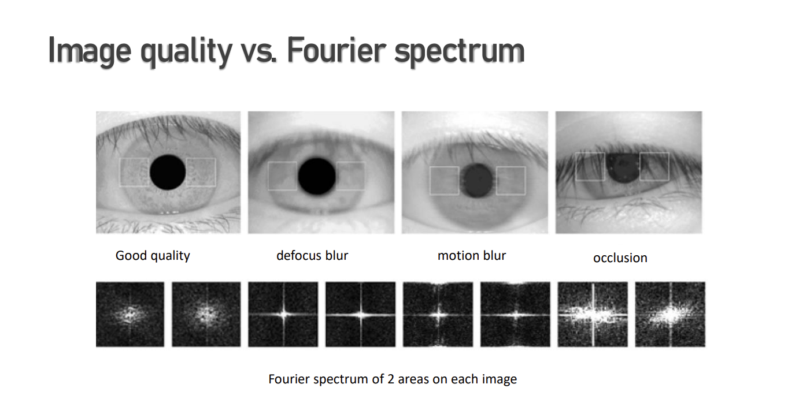

## 4.4. Feature extraction:

1. Segmentation:

- Taking only the vertical gradients for locating the iris boundary will reduce influence of the eyelids when performing circular Hough transform.

2. Extract:
    - Pupil detection: Circular Hough Transform
    - Eyelids, eyelashes detection: Linear Hough Transform -> remove

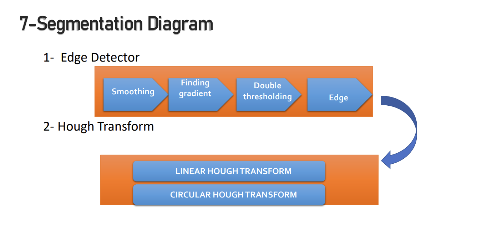

## 4.5. Further processing:

1. Normalization:  
    
        Process involves aligning key features, such as the pupil, collarette, and other iris patterns, to a consistent position

2. Feature encoding (extraction): 

            Extracted the features of the normalized iris by filtering the normalized iris region . 
            
            Extracted the features of the normalized iris by filtering the normalized iris region . 
            A Gabor filter is often applied on the entire image at once and unique features are 
            extracted

    - Feature encoding was implemented by convolving the normalized iris with 1D Gabor wavelets.

## 4.6. Feature matching:

1. Hamming distance employed by Daugman
2. Weighted Euclidean Distance employed by Zhu et al.
3. Normalized correlation employed by Wildes

# 5. FACE

## 5.1. Introduction:

- Advantages:
    1. Most natural for humans
    2. Non-intrusive
    3. Highly applicable:
        - Static identity verification
        - Uncontrolled face detection and Identification from video
- Disadvantages:
    1. Medium to Low performances
    2. Not unique (twins)
    3. Aging and time effects

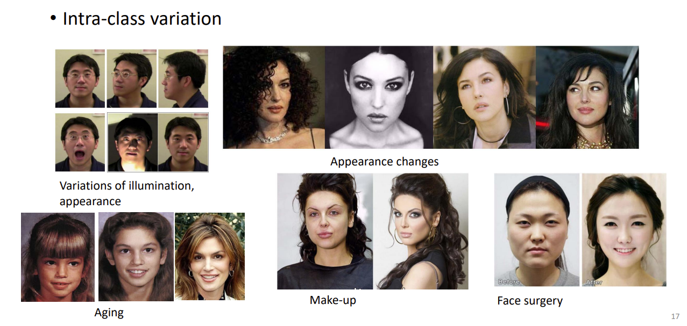

## 5.2 Features:

1. Level 1:

- Skin color
- Face shape

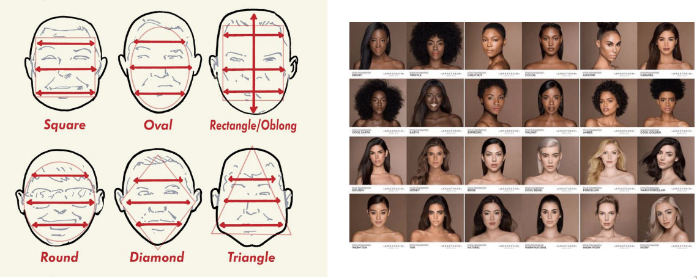

2. Level 2:

- Localized face information such as the structure of the face components (e.g., eyes), the relationship between facial components and the precise shape of 
the face.

3. Level 3:
- consist of unstructured, micro level features on the face, which includes: 
    1. scars, 
    2. freckles, 
    3. skin discoloration, 
    4. and moles23

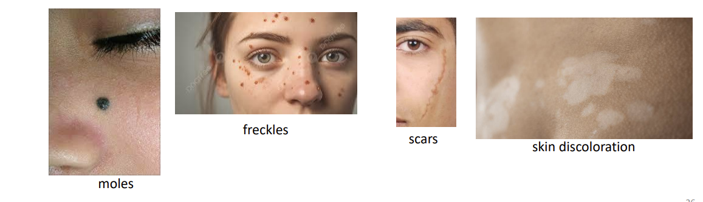

## 5.3. Image acquisition:

1. 2D images:
    - Frontal view of a face contains more details than a profile view and multi-camera configurations for pose variation problem
    - 2D face images are also greatly affected by variations in illumination and spatial resolution

2. 3D images:
    - Advantages of 3D face representation:
        - Illumination invariant
        - Pose invariant
    - Disadvantage:
        - Not invariant to changes in expression, aging, and occlusion
    - Longer acquisition time

3. Videos
    - Continuously capture face images ➔ enabling the selection of a good quality face image
    - Advantages of video camera over still camera
    - Multiple frames of the same subject:
        - Variety of poses
        - Temporal information pertaining to an individual’s face
        - Facial motion

## 5.4. Feature extraction:

1. Viola-Jones algorithm:
    - Main idea:
        - Represent local texture with efficiently computable “rectangular” features within window of interest
        - Select discriminative features to be weak classifiers
        - Use boosted combination of them as final classifier
        - Form a cascade of such classifiers, rejecting clear negatives quickly
    - **THE NEED OF INTEGRAL IMAGES in Viola-Jones algorithm**: Integral images speeds up the calculating process within the window of interest, reducing to constant time for each window.

2. PCA:
- Reducing the complexity of a face by using Linear Algebra (in the form of eigenvectors) or Statistics.

3. Texture-based recognition:
- SIFT
- LBP

## 5.5 Feature matching:

- Distance matching

# 6. GAIT:

## 6.1. Introduction:

- Gait: the way we walk
- Gait is a behavioral biometrics
- More information from gait:
    - Physical (health) condition
    - Gender, Age
    - Mood, 

- Since gait is a behavioral biometrics, there are factors that can affect it:
    - Mood
    - Physical condition
    - Shoes
    - Light

- Advantages of gait:
    - Farthest distance
    - Easy to measure

## 6.2. Features:

- Appearance-based features
    1. Silhouette features
    2. Optical flows features
    3. Model-based features

- **KEY CONCEPT** -  Gait cycles :
    - A gait cycle is between where the same foot touches the ground for the first and second time.
    - Human gait cycle is about 1 second
    - For the purpose of normalization of silhouettes and computing gait templatessuch as GEI

## 6.3 Features extraction:

1. Gait energy image (GEI):
- Spatially well-aligned, temporally averaged gait frames within one gait cycle
- Empirically 30 frames/whole sequence of frames enough to cover a complete gait cycle.
- F(i,j) indicates how likely there appears part of a human body in the position (i,j)
- GEI is robust to the silhouette noise, but may have a high dimensionality

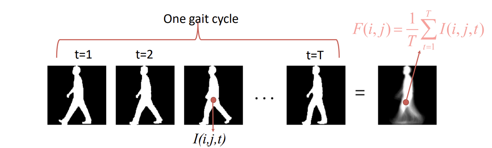

2. Chrono Gait Image (CGI):
- encode temporal information in the silhouette images with additional colors to generate a chrono-gait image.
- The goal of CGIs is to compress the silhouette images into a single image without losing too much temporal relationship between the images

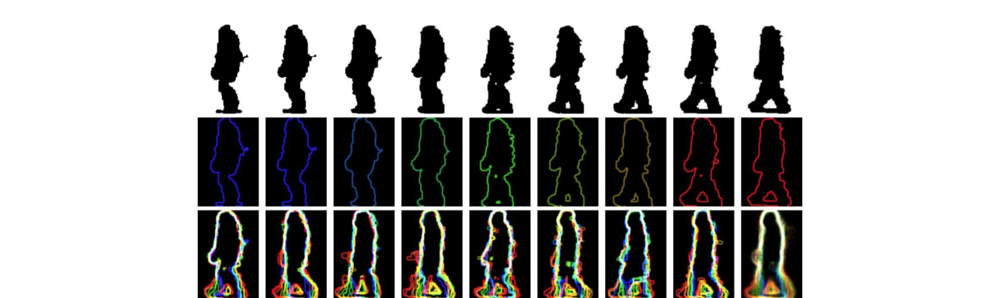

3. Gait Entropy Image (GEnI):

- Calculate Shannon entropy for each pixel in the silhouette images.
- The dynamic area of human body (legs and arms) are represented by higher intensity values in the GEnIs. In contrast, the static areas such as torso give rise to low intensity values.
- Silhouette pixel values in the dynamic areas are more uncertain and thus more informative leading to higher entropy values.

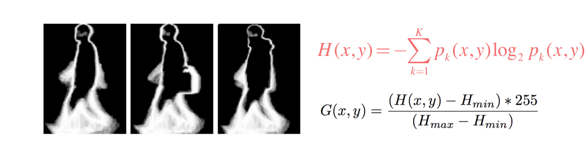

## 6.4. Feature matching:

- 2 main approach: 
    + Speed varirant 
    + Speed invariant

1. Speed variant:
- Does not perform seperation of motion and body shape features from a GEI image.
2. Speed invariant:
- Perform decoupling to extract motion and body shape features from a GEI, then proceed to train different model for each features

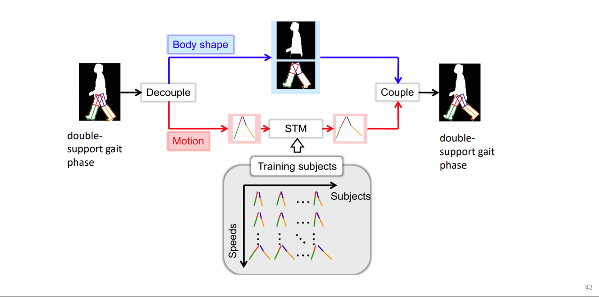

## 7. OTHER BIOMETRICS:

## 7.1. Ear:

1. Introduction:

- Ear geometry recognition uses the shape of the ear to perform identification 
- Suggestions have been made that the shapes and characteristics of the human ear are widely different 
- An infrared image can be used to eliminate hair
- Might be recognized at a distance
- Shape is stable despite aging
- Minimally impacted by changes in facial expression
- Image acquisition does not involve explicit contact with the sensor

2. Features:

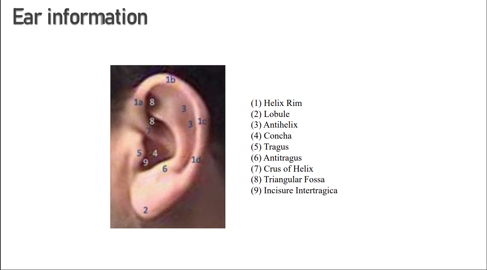

3. Ear Detection
- Sliding window with template matching
- Sliding window with Viola &Jones Adaboost method (~face detection)
- SIFT features

4. Ear feature extraction
- Landmarks
- Edge features
- LBP features

## 7.2. Hand geometry:
1. Introduction:
- Focus on geometric features of one's hand.
- Being implemented in several applications, locations.
- Non-intrusive.
2. Features:
- width of the fingers at various locations, 
- width of the palm,
- thickness of the palm, 
- length of the fingers, 
- contour of the palm,…

## 7.3 Key-strokes:

1. Introduction:
- Rhymtm that ones type is a form of biometrics.
- 100% software-based, requiring no sensor more sophisticated than a home computer

2. Features:

- Interval: the time between the release of one key and pressing the next;
- Dwell time: the time between pressing and releasing the same key;
- Latency: the time between pressing one key and releasing the next one;
- Flight time: time between pressing one and the next key;
- Up to up: the time between releasing the first and next key.

## 7.4. Retina:

1. Introduction:

- Retina: the structure of one's blood vessel  emanate from the optic nerve and disperse throughout the retina can be used as a form of biometrics.
- No two retinas are the same, even in identical twins.
- Retina information is a constant.

2. Features:

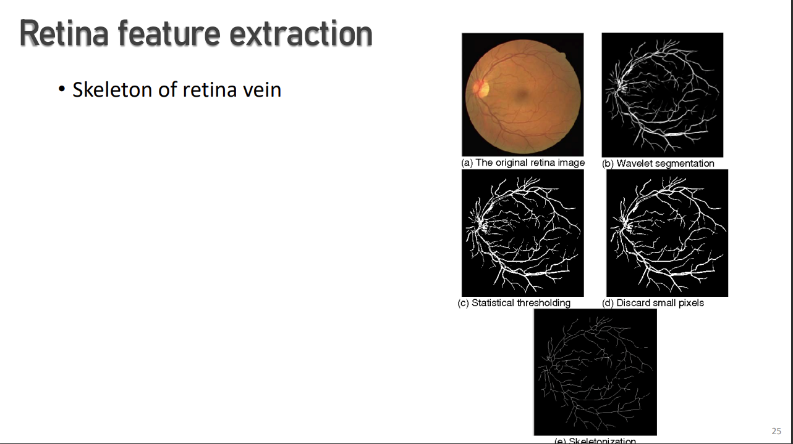

## 7.5. Body odor:

# 8. MULTIMODAL BIOMETRICS:

