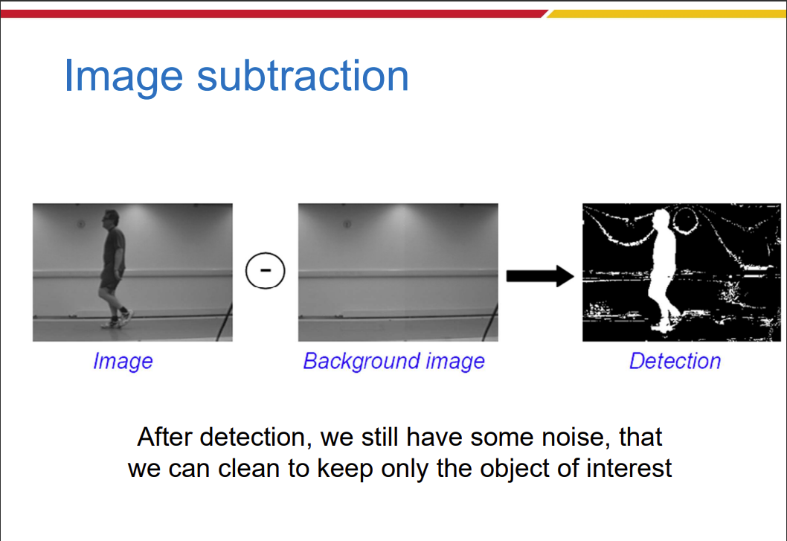
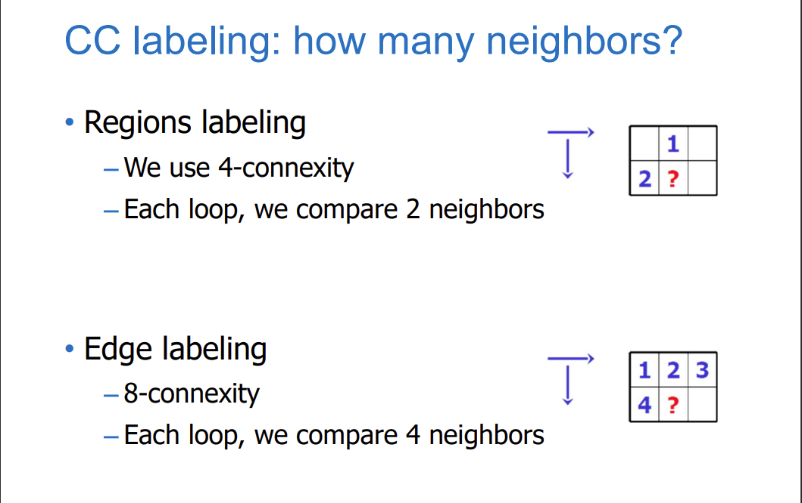

# COMPUTER VISION

# I. BASIC GRAY LEVEL TRANSFORMATION

## 1. Image Negatives:

- The negative of an image with gray levels in the range [0, L-1] is obtained by s = L - 1 - r

## 2. Log-transformations:

1. Log-transform:
    - **Characteristic**:
        1. This transformation maps a narrow range of low gray-level values in the input image into a wider range of output levels. 
        2. The opposite is true of higher values of input levels. 
    - **Usage**: Expand the values of dark pixels in an image while compressing the higher-level values.

2. Inverse log-transform:

- **Characteristic**: Opposite to log-transform.
- **Usage**: Compress dark pixels, expand light pixels.

## 3. Power-Law (Gamma) Transformations:

## 4. Piecewise-linear transformation:

## 5. Histogram equalization:

- **HISTOGRAM EQ FOR COLOR IMAGES**:

# II. IMAGE FILTERING

## 1. Convolution and Spatial-filtering:

### 1.1. Convolution and Correlation:

## 2. Smooth filtering:

### 2.1 Mean filtering:

### 2.2. Gaussian filtering:

# III. Arithmetical/Logical Operations

## 1. AND operation: 

## 2. OR op:

## 3. Image addition:

## 4. Average image:

## 5. Image subtraction:

## 6. Image multiplication:

- Pretty much the same as image addition.

# IV. BINARY IMAGES, THRESHOLDING AND MORPHOLOGICAL OPERATORS

## 1. Binary images:

## 2. Thresholding:

## 3. Morphological operators:

### 3.1 Dilation:

### 3.2 Erosion:

### 3.3 Opening:

- Erode, then dilate
- Remove small objects, keep original shape

### 3.4 Closing: 

- Dilate, then erode 
- Fill holes, but keep original shape

# V. CONNECTED COMPONENT LABELING:

- For region labeling: 
    - We use 4-connexity
    - Each loop, we compare 2 neighbors.

- For edge labeling:
    - We use 8-connexity
    - Each loop, we compare 4 neighbors.

# VI. FREQUENCY IN IMAGES:

