# CHAPTER 2 - PROCESS MANAGEMENT

### 1. PROCESS

1. Notion of process:

- A program is a piece of executable machine language that is stored on the disk. 

- Process is a running instance of a programm.

- Processes state:

| Name |  Description |
| ---- | ---- |
| New | In this step, the process is about to be created but not yet created.  It is the program that is present in secondary memory that will be picked up by OS to create the process.|
| Ready | New -> Ready to run. The process is loaded into the main memory and    waiting to get the CPU time for its execution|
| Running | The process is chosen from the ready queue by the CPU for execution and the instructions within the process are executed by any one of the available CPU cores. |
| Blocked | Whenever the process requests access to I/O or needs input from the user or needs access to a critical region(the lock for which is already acquired) it enters the blocked or waits for the state.|
| Ready suspend | Process that was initially in the ready state but was swapped out of main memory and placed onto external storage by the scheduler|
| Blocked suspend |  Similar to suspend ready but uses the process which was performing I/O operation and lack of main memory caused them to move to secondary memory. |
| Terminated | Process is killed as well as Process Control Block (PCB) is deleted. |

- Process control block (PCB): an information structure allows identify **only 1 process**.

> ![NOTE]
> | Single-threaded process | Multi-threaded process |
> | ---- | ---- |
> | A running process with only one thread | Have multiple threads that can run simultaneously |

2. Process scheduling:

- **Purpose**: Maximize CPU's usage time.

- Types of process queue:

| Name |  Description |
| ---- | ---- |
| Job-queue | Set of processes in the system |
| Ready-Queue | Set of processes exist in the memory, ready to run |
| Device queues | Set of processes waiting for an I/O device.  Queues for each device are different |

- Process cycle:

    - Process selected and running

            1. process issue an I / O request, and then be placed in an I / O queue
            2. process create a new sub-process and wait for its termination
            3. process removed forcibly from the CPU, as a result of an interrupt, and be put back in the ready queue 

    - In case (1&2) after the waiting event is finished:

            1. Process eventually switches from waiting →ready state
            2. Process is then put back to ready queue
    
    - Process continues this cycle (ready, running, waiting) until it terminates.

            1. It’s removed from all queues
            2. Its PCB and resources deallocated

- Job Scheduler:

    - Select processes from program queue stored in disk and put into memory to execute
    - Not frequently (seconds/minutes) 
    - Control the degree of the multi-programming (number of process in memory) 
    - When the degree of multi-programming is stable, the scheduler may need to be invoked when a process leaves the system
> [!WARNING]
> Job selection’s problem: The job scheduler should select a mix of both types of process ( heavy CPU / IO bound ) to ensure optimal performance.

- CPU Scheduler:

    - Selects from processes that are ready to execute, and allocates the CPU to 1 of them.
    - Frequently work (example: at least 100ms/once).
    - the short-term scheduler must be fast (e.g.: ***10ms to decide ⇒10/(110)=9% CPU time is wasted***)

- Context switch: act of switching CPU from 1 process to another. (Medium-term scheduler)

3. Operation on process:

- Process may create several new processes
    - The creating process: parent-process
    - The new process: child-process
- Child-process may create new process ⇒ Tree of process

- Resource allocation in a process tree:
    - Child receives resource from
        - OS
        - parent-process (2 case like below block)
            
                - All of the resource 
                - a subset of the resources of the parent process (to prevent a process from creating too many children)
    - When a process creates a new process, two possibilities exist in terms of execution: 
        1. The parent continues to execute concurrently with its children
        2. The parent waits until some or all of its children have terminated 

- Child process termination: 
    - Finishes executing its final statement and asks the OS to delete (exit) 
        - Return data to parent process
        - Allocated resources are returned to the system
    - Parent process may terminate the execution of child process
        - Parent must know child process’s id  ⇒ child process has to send its id to parent process when created
        - Use the system call (abort)
    - Parent process terminate child process when

            1. The child has exceeded its usage of some of the resources 
            2. The task assigned to the child is no longer required 
            3. The parent is exiting, and the OS does not allow a child to continue 
            4. Cascading termination.

4. Process cooperation:

- Process relation: 

        1. Independence: Not affect or affected by other running process in the system
        2. Cooperation: affect or affected by other running process in the system

- Reason why process wants to cooperate: 

        1. Share Information
        2. Speedup Computation
        3. Provide Modularity 
        4. Increase the convenience
- Process collaborate requires mechanism that allow process to:

        1. Communicate with each other
        2. Synchronize their actions

> [!TIP]
> For more information on this you can read page 43-45 of Chapter 2   ( or just google producer - consumer problem)

5. Inter-process communication:

- Memory sharing model:
    - Process share a common memory area
    - Implementation codes are written explicitly by application programmer
    - Example: Producer-Consumer problem

- Message passing system:
    - Require two basic operations:
            
            1. Send (msg) msg has fixed or variable size
            2. Receive (msg)
    
    - If 2 processes P and Q want to communicate, they need to:

        Establish a communication link (physical/logical) between them
        **OR** Exchange messages via operations: send/receive

    1. Direct communication: 
        - Each process that wants to communicate must explicitly name the recipient or sender of the communication

        - Communication link’s properties:

                + A link is established automatically 
                + A link is associated with exactly 2 processes
                + Exactly 1 link exists between each pair of processes
                + Link can be 1 direction but often 2 directions 
        
        - Operations:

                1. Send (to a process)
                2. Receive (from a process)
    2. Indirect communication:

        - Messages are sent to and received from mailboxes, or ports    
        - Communication link’s properties:

                + Established only if both members of the pair have a shared mailbox
                + A link may be associated with more than 2 processes
                + Each pair of communicating processes may have many links
        
        - Opeations:

                1. Create a new mailbox
                2. Send (to mailbox)
                3. Receive (from mailbox)
                4. Delete mailbox

- Buffering:
    -  Messages exchanged by communicating processes reside in a temporary queue
    - A queue can be implemented in 3 ways:

        1. Zero capacity: 
            - maximum length 0 => the link cannot have any messages waiting in it
        
        2. Bounded capacity:
            - Queue has finite length n ⇒ store at most n messages
            - If the queue is not full, message is placed in the queue and the sender can continue execution without waiting
            - If the link is full, the sender must block until space is available in the queue 

        3. Unbound capacity:
            - The sender never blocks

- Sockets:
    - Socket is defined as an endpoint for communication, each process has 1 socket.
    - Structure:

            1. IP Address: Computer address in the network
            2. Port: identifies a specific process
    
    - Socket types:

                1. Stream Socket: Based on TCP/IP protocol → Reliable data transfer
                2. Datagram Socket: based on UDP/IP protocol → Unreliable data transfer

### 2. THREADS

1. What is a thread? 
    - Basic CPU using unit, consists of

            1. Thread ID
            2. Program Counter 
            3. Registers 
            4. Stack space
    
    - Sharing between threads in the same process

            1. Code segment
            2. Data segment (global objects) 
            3. Other OS’s resources (opening file…)

    - Thread can run same code segment with different context (Register set, program counter, stack)

    - **EACH** process has at least one thread

2. Benefits of using threads:

    - Responsiveness: 
        - allow a program to continue running even if part of it is blocked or is performing a long operation. Example: A multi-threaded Web browser 

                • 1 thread interactives with user
                • 1 thread downloads data

    - Resource sharing:
        - threads share the memory and the resources of the process

                • Good for parallel algorithms (share data structures) 
                • Threads communicate via sharing memory
        - Allow application to have many threads act in the same address space
    
    - Economy
        - Create, switch, terminate threads is less expensive than process
    
    - Utilization of multiprocessor architectures
        - each thread may be running in parallel on a different processor.

3. User and kernel level threads:

- User-level threads:

    - Thread management is done by application
    - Kernel does not know about thread existence
    - Process scheduled like a single unit
    - User threads are supported above the kernel and are implemented by a thread library
    - Library support creation, scheduling and management...

> [!IMPORTANT]
> **Advantage**: Fast to create and manage
>
> **Disadvantage**: if a thread perform blocking system call , the entire process will be 
blocked ⇒ Cannot make use of multi-thread.

- Kernel-level threads:
    - Kernel keeps information of process and threads
    - Threads management is performed by kernel
        - No thread management code inside application
    - Thread scheduling is done by kernel
    - OSs support kernel thread: Windows NT/2000/XP, Linux, OS/2,..

> [!IMPORTANT]
> **Advantage**: 
>
> 1 thread perform system call (e.g. I/O request), other threads are not affected
>
> In a multiprocessor environment, the kernel can schedule threads on different processors
>
> **Disadvantage**: Slow in thread creation and management

4. Multithreading model:

- Many-to-one model:

    - Maps many user-level threads to 1 kernel thread. 
    - Thread management is done in user space
    -  implemented on OSs that do not support kernel threads use the many-to-one model
    - Properties:

            1. Efficient
            2. the entire process will block if a thread makes a blocking system call
            3. multiple threads are unable to run in parallel on multi processors

- Many-to-one model:

    - Maps each user thread to a kernel thread
    - Allow another thread to run when a thread makes a blocking system call
    - Creating a user thread requires creating the corresponding kernel thread

            • the overhead of creating kernel threads can burden the 
            performance of an application
            ⇒ restrict the number of threads supported by the system

    - Implemented in Window NT/2000/XP

- Many-to-many model:

    - Multiplexes many user-level threads to a smaller or equal number of kernel threads
    - Number of kernel threads: specific to either a particular application or a particular machine
    - Combine advantages of previous models:

            • Developers can create as many user threads as necessary
            • kernel threads can run in parallel on a multiprocessor
            • when a thread performs a blocking system call, the kernel can schedule another thread for execution

    - Supported in: UNIX

- Two-level model: 
    - A variation of many to many
    - Allow favor process with higher priority

>[!WARNING]
> Threading problem: The result of parallel running threads depends on the order of accessing the sharing variable

### 3. CPU SCHEDULING

1. Basic concepts:

    - System only have 1 processor: only 1 process running at a time.  
    Process is executed until it must wait, typically for the completion of some I/O request

        - In a simple system: CPU is not utilized during this time -> wasted CPU time.       
        - Multiprogramming system: try to use this time productively, give CPU for another process

> [!NOTE]  
> Scheduling is a fundamental OS’s function
>
> Switching CPU between processes means utilizing the system more efficiently

- Typical process execution cycle:
    - Process execution consists of a cycle of CPU execution and I/O wait
    - Begins with a CPU burst
    - followed by an I/O burst
    - CPU burst → I/O burst → CPU burst → I/O burst → . . . 
    * End: the last CPU burst will end with a system request to terminate execution

- Process classification - Based on distribution of CPU & I/O burst

| Name | Attribute |
| ---- | ---- |
| CPU-bound processes | might have a few very long burst |
| I/O-bound processes | would typically have many very short CPU bursts |

2. CPU scheduler:

- CPU idle -> select 1 process from ready queue to run it  CPU scheduling decisions may take place when process switches from: 
    1. running -> waiting state (I/O request)
    2. running -> ready state (out of CPU usage time→ time interrupt)
    3. waiting -> ready state (e.g. completion of I/O)
    4. Or process terminates

> [!NOTE]  
> Case 1&4 ⇒ non-preemptive scheduling scheme
>
> Other cases ⇒ preemptive scheduling scheme

- Scheduling schemes:

| Non-preemptive scheduling | Preemptive scheduling |
| ----------------------- | ----------------------- | 
| Process keeps the CPU until it releases the CPU either by:    1. terminating    2. switching to the waiting state    Non-preemptive scheduling **DOES NOT** require the special hardware (timer)  | Process only allowed to run in specified period.   At the end of the period time interrupt appear, dispatcher is invoked to decide which process goes next.   Protect CPU from “CPU hungry" processes.   Preemptive scheduling create a new problem:   1. Process 1 updating data and the CPU is taken   2. Process 2 executed and read data which is not completely update | 

  
3. Scheduling criteria:

- CPU utilization 

    - keep the CPU as busy as possible
    - should range from 40 percent (for a lightly loaded system) to 90 percent (for a heavily used system)
- Throughput
    - number of processes completed per time unit
    - Long process: 1 process/hour
    - Short processes: 10 processes/second
- Turnaround time
    - Interval from the time of submission of a process to the time of completion 
    - Can be the sum of: 
    
            1. periods spent waiting to get into memory
            2. waiting in the ready queue
            3. executing on the CPU
            4. doing I/O

- Waiting time
    - sum of the periods spent waiting in the ready queue

    - CPU-scheduling algorithm does not affect the amount of time during which a 
process executes or does I/O;  it affects only the amount of time that a process 
spends waiting in the ready queue

- Response time
    - time from the submission of a request until the first response is produced
    - process can produce some output fairly early
    - continue computing new results while previous results are being output to the user

4. Scheduling algorithms:

- First Come, First Served (FCFS):
    - Rule: process that requests the CPU first is allocated the CPU first  
    Process owns CPU until it terminates or blocks for I/O request
    
    - Pros and cons:
        - Simple, easy to implement
        - Short process must wait like long process

- Shortest job first (SJF):

    - Rule: associates with each process the length of the latter's next CPU burst
        - process that has the smallest next CPU burst
        - Two methods
            - Non-preemptive
            - preemptive (SRTF: Shortest Remaining Time First)

    - Pros:
        - SJF (SRTF) is optimal: Average waiting time is minimum
    - Cons:
        - It’s not possible to predict the length of next CPU burst
        - Predict based on previous one (impossible)

- Round robbin (RR):
    - Rule:
        - Each process is given a time quantum (time slice) τ to be executed
        - When time’s up processor is preemptive, and process is placed in the last position     of ready queue
        - If there are n process, longest waiting time is (n − 1)τ

- Multilevel queue scheduling:
    - Ready queue is divided into several separate queues
    - Processes are permanently assigned to 1 queue
    - Based on some properties of the process, such as memory size, priority, or type..
    - Each queue has its own scheduling algorithm

- Some consideration:
    - Commonly implemented as fixed-priority preemptive scheduling
        - Processes in lower priority queue only executed if higher priority queues are empty
    - High priority process preemptive CPU from lower priority process
    - Starvation is possible
    - Time slice between the queues
        - foreground process queue, 80% CPU time for RR 
        - background process queue, 20% CPU time for FCFS

- A solution to the fixed-priority preemptive scheduling:
    - Allows a process to move between queues
 
    - If a process uses too much CPU time ->moved to a lower priority queue
    - I/O-bound and interactive processes in the higher-priority queues
    - process that waited too long in a lower- priority queue may be moved to a higher-priority queue
    - Prevent “starvation”

- Queue’s scheduler is defined by the following parameters:
    - number of queues
    - scheduling algorithm for each queue 
    - method used to determine when to upgrade/demote a process to a higher/lower priority queue 
    - method used to determine which queue a process will enter when that process needs service

5. Multi-processor scheduling:

- 2 model
    - Symmetric multiprocessor
    - Asymmetric multiprocessor 
 

 - Assymetric multiprocessor problem:   
    - 1 processor execute the scheduling program
    - Only 1 processor can access process queue
    - May be bottleneck at 1 processor

- Symmetric multiprocessor:
    - Each processor runs its own Scheduler
    - Independently selects available proceses in the queue

- Queue management schemes in symmetric multiprocessor model:
    1. Each processor has its own ready queue:
        - Pros: Easy to organize
        - Cons: Exist idle processor with empty queue while other processor has to do a lot of computation

    2. Share ready queue (Global queue):
        -  Pros:
            - Efficient use of CPU
            - Fair to the Process
        - Cons:
            - The problem of sharing data structures (queues):
                - 1 TT is selected by 2 processors or 
                - 1 TT is lost on the queue

    3. Hybrid - combine the above schemes:
        - Use both local and global queue
        - Share loads from queues
        - Each CPU works with its own local queue

6. An example of priority-based in windows:

### 4. Critical resources and process synchronization:

1. Critical resources:

- What is a critical resource?:
    - Resource that is limited of sharing capability
    - Required concurrently by processes
    - Can be either physical devices or sharing data

- Problem with critical resources:
sharing critical resource may not guarantee data completeness.

- Critical section:
    - The part of the program where the shared memory is accessed is called the critical region or critical section
    - When there are more than 1 process use critical resource then we must synchronize them a.k.a **ONLY ONE** process can stay inside the critical section at a time.

2. Conditions to ensure synchronization:

    1. Mutual Exclusion: Critical resource does not have to serve the number of process more than its capability at any time.
        
    2. Progressive: If critical resource still able to serve and there is any process want to be executed in critical section then this process can use critical resource

    3. Bounded Waiting: There exists a bound on the number of times that other processes are allowed to enter their critical sections after a process has made a request to enter its critical section and before that request is granted

 > [!IMPORTANT]
 > I skip the intro about semaphore and went straight to it's actual implementation (the version with block() and wakeup() operations) because I think it's redudant.

3. Methods to tackle the critical resources problem:

    1. Variable lock:
        - Each process uses 1 byte in the sharing memory area as a lock
            - enters critical section, lock (byte lock = true) 
            - exits from critical section, unlock (byte lock= false)

        - Process want to enter critical section: check other process’s lock ‘s status
            - Locking ⇒ Wait
            - Not lock ⇒ Has the right to enter critical section

    - Pseudo code:
    

    > REMARK
    > This method does not properly synchronize processes
    > - Two processes request resource at the same time
    >
    >    1. Mutual exclusion problem (Case 1) 
    >    2. Progressive problem (Case 2)
    > - Reason: The following actions are done separately
    >
    > 1. Check the right to enter critical section
    > 2. Set the right to enter critical section

    2. Decker's algorithm:

    - Similar to variable lock, but also use a 'turn' variable to show process with priority.

    

    > !REMARK
    > - Synchronize properly for all cases
    > - No hardware support requirement -> implement in any languages
    > - Complex when the number of processes and resources increase
    > - “busy waiting” before enter critical section
    > - When waiting, process must check the right to enter the critical section => Waste processor’s time

    3. Test and set:
    - Utilizing hardware support via uninterruptible instructions.
    - Pseudo codes for instructions:
        1. Test and change the content of a word

                boolean TestAndSet(VAR boolean target) {
                    boolean rv = target; 
                    target = true; 
                    return rv;
                }    
        
        2. Swap the content of two different words

                void Swap(VAR boolean , VAR boolean b) { 
                    boolean temp = a; 
                    a = b; 
                    b = temp;
                }
                
    - Code block is uninterruptible when executing
    - When called at the same time, done in any order

    - Remark:
        - Simple, complexity is not increase when number of processes and critical resource increase
        - “busy waiting” before enter critical section => Waste processor’s time
        - No bounded waiting guarantee - The next process enters critical section is depend on the resource release time of current resource-using process

    4. Semaphore:   

    -   An integer variable, initialized by resource sharing capability
        - Number of available resources (e.g. 3 printers)
        - Number of resource’s unit (10 empty slots in buffer)
        - Can only be changed by 2 operation P and V     
    - Overcome "busy waiting" problem by using block() and wakeup() operation.         
    - Semaphore pseudo code:

        typedef struct{
            int value
            struct process *Ptr

        }Semaphore

    - Operation's P pseudo code:
            
            wait(S){
                S.value--
                if(S.value<0){
                    Insert process to S.ptr
                    block()
                }
            }

    - Operation's V pseudo code:

            signal(S){
                S.value++
                if(S.value<=0){
                    Get process P from S.ptr
                    wakeup(P)
                }
            }
    
    - P and V are uninterruptible instructions

    - Remark:
        - Easy to apply for complex system
        - No busy waiting 
        - The effectiveness is depend on user

5. Deadlocks:

- A set of processes is deadlocked if each process in the set is waiting for an event that only another process in the set can cause

- 4 conditions for deadlocks:
    
    1. Critical resource:
        - Resource is used in a non-shareable model
        - Only one process can use resource at a time
        - Other process request to use resource ⇒ request must be postponed until resource is released

    2. Wait before entering critical section:
        - Process can not enter critical section has to wait in queue
        - Still own resources while waiting

    3. No resource reallocation system
        - Resource is non-preemptive
        - Resource is released only by currently using process after this process finished its task
    
    4. Circular waiting
        - Set of processes {P0, P2, . . . , Pn} waiting in a order: P0 → R1 → P1; P1→ R2 → P2; . . . Pn−1 → Rn →Pn; Pn → R0 → P0 creating a non-stop loop.

5. Methods for battling deadlock:

- Deadlock prevention:
    - Objective - Attack 1 of 4 required conditions for deadlock to appear:  

    1. Critical resource:
    - Reduce the system’s critical degree
        - Shareable resource(read-only ffile): accessed simultaneously
        - Non-shareable resource: Cannot be accessed simultaneously

    - SPOOL mechanism(Simultaneous peripheral operation on-line) 
        - Do not allocate resource when it’s not necessary
        - A limited number of processes can request resource

    2. Wait before entering critical section
  
        - Prior allocate
            - processes request all their resources before starting execution and only run when required resources are allocated
            -  Effectiveness of resource utilization is low

        - Resource release
            - Process releases all resource before apply(re-apply) new resource
            - Process execution’s speed is low
            - Must guarantee that data kept in temporary release resource won’t be lost

    
    
    3. Non-preemptive resource
        - Allow process to preempt resource when it’s necessary

    4. Circular wait
        - Provide a global numbering of all type of resources
            - R = {R1, R2, . . . Rn}: Set of resources
        - Construct an ordering function f : R → N based on the order of resource utilization
            - f(Tape) = 1 
            - f(Disk) = 5 
            - f(Printer) = 12
        - Process can only request resource in an increasing order
        - holding resource type Rk can only request resource type Rj satisfy f(Rj)> f(Rk) 
        - Process requests resource Rk has to release all resource Ri satisfy condition f(Ri) ≥ f(Rk)

- Deadlock avoidance:

    - Verify all resource request
        - If the system is still safe after allocate resource ⇒ allocate
        - If not ⇒ process has to wait
    - Banker's algorithm:
        - Data structure:

        | Name | Function |
        | ---- | ---- |
        | Available | Vector with length m represents the number of available resource in the system. (Available[3] = 8 ) |
        | Max | Matrix n ∗m represents each process maximums request for each type of resource. (Max[2,3] = 5 ⇒?) |
        | Allocation | Matrix n ∗m represents each process maximums request for each type of resource. (Max[2,3] = 5 ⇒?) |
        | Need | Matrix n ∗m represents amount of resource is needed for each process  (Need[2,3] = 3 ⇒?)  Need[i][j] = Max[i][j] - Allocation[i][j] |
        | Work | vector with length m represents how much each resource still available |
        | Finish | vector with Boolean type, length m represents if a process is guaranteed to finish or not |

        - Pseudo code for banker's algorithm:

                BOOL Safe(Current Resource-Allocation State){ 

                    Work←Available 

                    for (i : 1 → n) Finish[i]←false                    
                    flag← true 

                    While(flag){ 

                        flag←false 

                        for (i : 1 → n)                         
                        if(Finish[i]=false AND Need[i] ≤Work){ 

                            Finish[i]← true 
                            Work ← Work+Allocation[i] 
                            flag← true

                        }//endif

                    }//endwhile 
                    
                    for (i : 1 → n) if (Finish[i]=false)return false;
                    return true;

                }//End function
        
    - Verify flow:

            1. if(Request[i]>Need[i]) => Error(Request higher than declared number)
            
            2. if(Request[i]>Available) => Block(Not enough resource, process has to wait)
            
            3. Set the new resource allocation for the system 
                - Available = Available - Request[i] 
                - Allocation[i] = Allocation[i] + Request[i] 
                - Need[i] = Need[i] - Request[i]
            
            4. Allocate resource based on the result of new system safety check 
            
            if(Safe(New Resource Allocation State)) 
                Allocate resource for Pi as requested
            else 
                Pi has to wait
                Recover former state (Available, Allocation,Need)

    - Example: Request[3,2] = 2: P3 requests 2 units of resource R2.

- Deadlock detection and recovery:
    - Instead of performing checking everytime a request for critical resource is performed,
    it'll check for deadlock periodically.

    - Reaction when detect deadlock:

        1. Terminate all processes 
        
        - Quick to eliminate deadlock
        
        - Too expensive
        
        - Killed processes may be almost finished
            
        2. Terminate processes consequently until deadlock is removed
           
        - After process is terminated, check if deadlock is still exist or not
            - Deadlock checking algorithm complexity is m ∗ n^2
        
        - Need to point out the order of process to be terminated
            - Process’s priority
            - Process’s turn around time, how long until process finish
            - Resources that process is holding, need to finish

        - Process termination’s problem 
            - Process is updating file ⇒ File is not complete 
            - Process is using printer ⇒ Reset printer’s status
        
        3. Resource preemption
        - Need to consider:       
            1. Victim’s selection 
                - Which resource and which process is selected? 
                - Preemptation ‘s order for smallest cost
                - Amount of holding resource, usage time. . .

            2. Rollback 
                - Rollback to a safe state before and restart
                - Require to store state of running process
            
            3. Starvation
                - One process is preempted many times ⇒ infinite waiting 
                - Solution: record the number of times that process is preempted

- Deadlock ignore:
    - Method implemented by modern operating systems.

> [!NOTE]
> TLDR: **IF I DON'T SEE ANY DEADLOCKS THAT MEANS THERE'S NO DEADLOCKS RIGHT?**
    

# CHAPTER 3 - MEMORY MANAGEMENT

## 1. INTRODUCTION

### 1.1 Example

| Step | Name | Purpose |
| ---- | ---- | ---- |
| 1 | Preprocessing | Remove comments, include header files in source code and replace macro name with code |
| 2 | Compiling | Convert source code into instructions |
| 3 | Assembling | Convert asm code into object code |
| 4 | Linking | Combine libraries and object code to create an executeable |

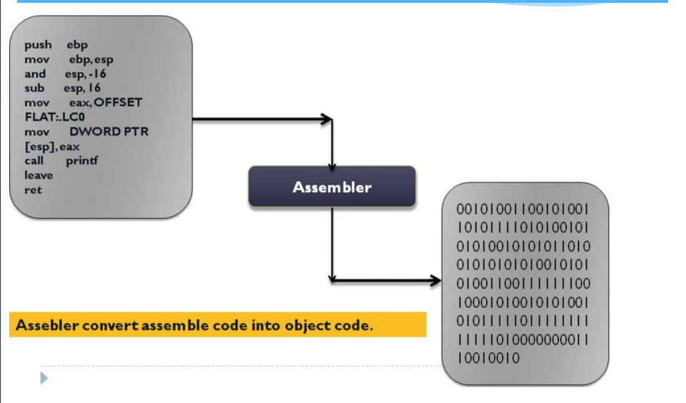
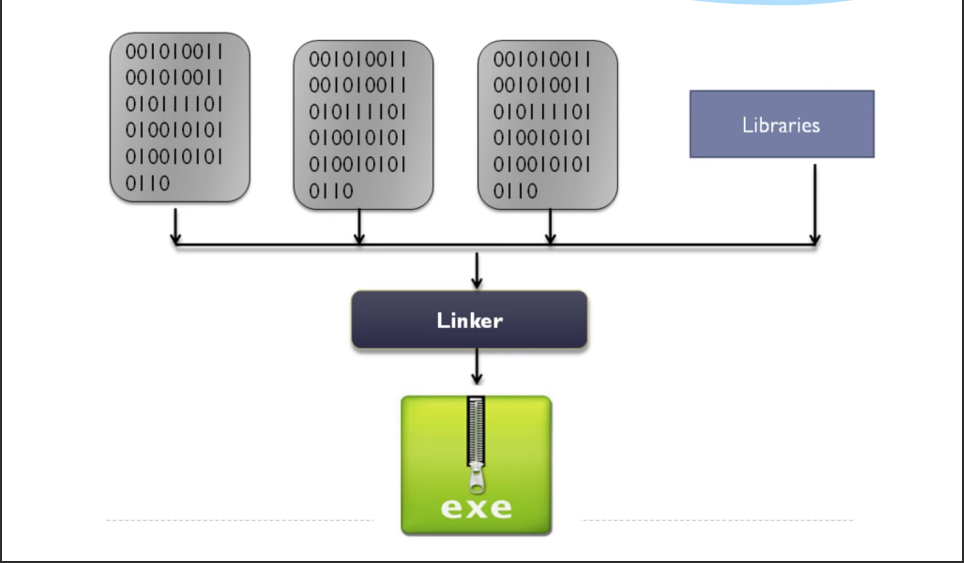

### 1.2. Memory and program
1. Memory leveling:
    - Memory is an important system’s resource
        - Program must be kept inside memory to run
    - Memory is characterized by size and access speed
    - Memory leveling by access speed

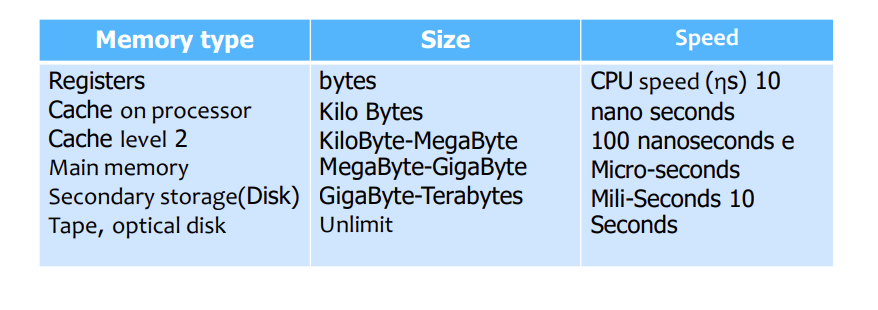

2. Main memory:
- Used for running program and data
- Array of memory block with size of bytes, words
- Each memory block has an address
    - Physical address

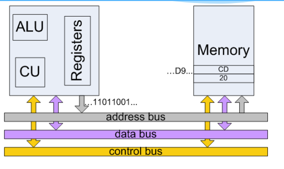

3. Program:

- Store on external storage devices

- Executable binary files
    - File’s parameters
    - Machine instruction (binary code), 
    - Data area (global variable), . . 

- Must be brought into internal memory and put inside a process to be  executed (process executes program) 

- Input queue 
    - Set of processes kept in external memory (normally: disk) 
    - Wait to be brought into internal memory and execute

- Program execution sequence:
    1. Load the program into main memory
        - Read and analysis executable file (e.g. *.com, file *.exe) 
        - Ask for a memory area to load program from disk
        - Set values for parameters, registers to a proper value
  
    2. Execute the program
        - CPU reads instructions in memory at location determined by program counter 
            - 2 registers CS:IP for Intel’s family processor (e.g. : 80x86)
        - CPU decode the instruction
            - May read more operand from memory
        - Execute the instruction with operand
        - If necessary, store the results into memory at a defined location
   
    3. Finish executing
        - Free the memory area that allocated to program

> ![WARNING]
> - Program may be loaded into any location in the memory
> - When program is executed, a sequence of addresses are generated
>
> => How to access memory?

### 1.3. Access binding

1. Types of address:

| Name | Definition |
| ---- | ---- |
| Symbolic | Name of object in the source program |
|  Relative address | Generated from symbolic address by compiler   Relative position of an object from the module’s first position |
| Absolute address | Generate from relative address when program is loaded into memory   For IBM PC: relative address <Seg :Ofs>→ Seg * 16+Ofs   Object’s address in physical memory – physical address  Example: JMP 010Ah ⇒ jump to the memory block at 010Ah at the same code segment (CS) |

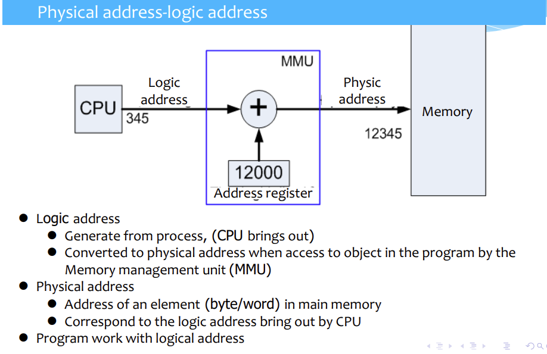

### 1.4 Program structure:

1. Linear:

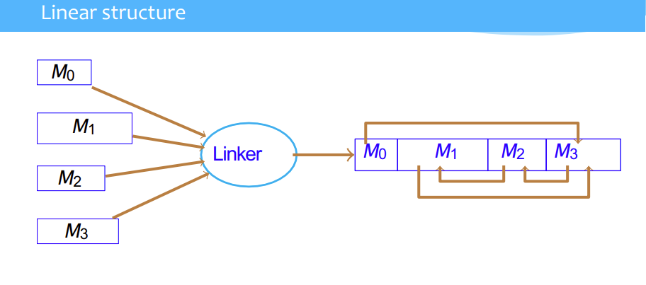

- After linking, modules are merged into a complete program
    - Contain sufficient information to be able to execute
    - External pointers are replaced by defined values  
    - To execute, required only one time to fetch into the memory   

**REMARKS**
- Advantages
    - Simple, easy to link and localizing the program
    - Fast to execute
    - Highly movable
- Disadvantages
    - Waste of memory
    - Not all parts of the program are necessary for the program’s execution
    - It’s not possible to run the program that larger than physical memory’s size

2. Dynamic loading:

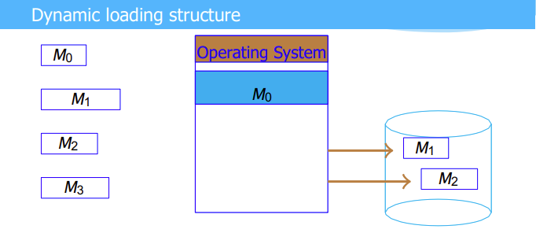

- Each module is edited separately
- When executing, system will load and localize the main module
- When module is needed, request for memory and load module into memory
- When a module is finished using or not enough memory, bring unnecessary modules out

**REMARKS**
- Advantage
    - Can use memory are smaller than the program’s size
    - High memory usage effectiveness if program is managed well

- Disadvantage
    - Slow when execution
    - Mistake may cause waste of memory and increase execution time
    - Require user to load and remove modules
    - User must understand clearly about the system
    - Reduce the program’s flexible

3. Dynamically-linked:

- Links will be postponed when program is executing
- Part of the code segment (stub) is utilized to search for corresponding function in the library in the memory
- When found, stub will be replace by the address of the function and function will be executed
- Useful for constructing library

4. Overlay:

- Modules are divided into different levels
    - Level 0 contains main modul, load and localize the program
    - Level 1 contains modules called from level 0’s module and these modules do not exist at the same time and so on ...
- Memory is also divided into levels corresponding to program’s levels
    - Size equal to the same level’s largest module’s size
- Overlay structure requires extra information
    - Program is divided into how many levels, which modules are in each levels
    - Information is stored in a file (overlay map)

- Module at level 0 is edited into an independent executable file

- During the initial stage of execution
    - Load level 0 module similar to a linear structure program
    - When another module is needed, load that module into corresponding memory’s level
    - If there are module in the same level exist, bring that module out

**REMARKS**
- Overlay structure allows program with larger size than memory area size allocated by the operating system, ***however***:
    - Require extra information from user
    - Effectiveness is depend on provided information
    - Memory usage effectiveness is depend on how program’s modules are organized
    - If there are exist modules that larger than other modules in the same level ⇒ the effective is reduced
    - Module loading process is dynamic but program’s structure is static ⇒ not change at each time running
    - When provided with more memory, the effectiveness does not increase

**FLOW OF A OVERLAY PROGRAM**

## 2. Memory management strategies

### 2.1 Fixed partition:

- Memory is divided inton parts

    - Each part is called a partition

    - Partitions size can be unequal
        - Utilized as and independent memory area
        - At a single time, only one program is allowed to exist

- Programs lie inside memory until finish

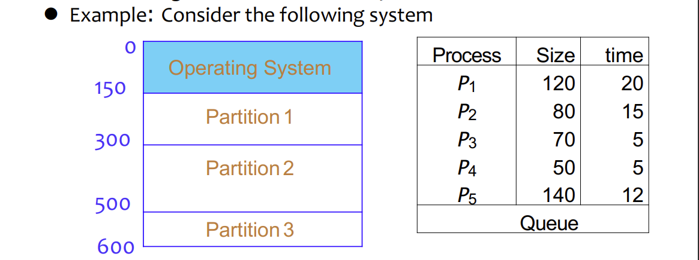

**REMARKS**
- Simple, easy for memory protection
    - Program and memory area have a protection lock
    - Compare 2 locks when program is loaded

- Reduce searching time

- Must copy controlling module into many versions and save at many places

- Number of parallel programs cannot be more than n

- Memory is segmented
    
        When there exists a program whose size is larger than the largest partition's size then:        
            - Total free memory is large enough but can not load any program

        ⇒Fix partition structure, merge neighboring partition

- Application
    - Large size disk management
    - IBM OS/360 operating system

### 2.2 Dynamic partition strategy

1. Rule:

**Only one management list for free memory**
- At the start, the whole memory is free for processes ⇒ largest hole
- When a process requests for memory

        Search in the list for a large enough hole for request

        If found
            Hole is divided into 2 parts
            One part allocate to process as requested
            One part return to the management list

        If not found
            Wait until there is a hole large enough
            Allow another process in the queue to execution (if the priority is guaranteed)

- When the process finish

        - Allocated memory area is returned to the free memory management list
        - Combine with other neighboring holes if necessary

2. Free memory area selection strategy:

| Name | Description |
| ---- | ---- |
| First Fit | First free area satisfy request |
| Best Fit | Most fitted area |
| Worst Fit | Largest area that satisfy request |

3. Memory reallocation problem:
- After a long working time, the free holes are distributed and caused 
memory lacking phenomenon ⇒ Need to rearrange memory

- Some solutions:
    
    1. Move process
    
            - Problem: 
                1. Internal objects when move to new place will has new address    
                    - Use relocation register to store process’s relocation value
                2. Select method for lowest cost 
                - Move all process to one side ⇒ largest free holes
                - Move processes to create a sufficient free hole immediately
    
    2. Swapping process
    
            - Problem: 
                1. How to select a right time to suspend process
                2. Bring process and corresponding state to external memory
                    - Free allocated memory area and combine with neighboring areas
                3. Reallocation to former place and restore state
                    - Use relocation register if process is moved to different places

**REMARKS**

- No need to copy the controlling modules to different places

- Increase/decrease parallel factor depend on the number and size of programs

- Cannot run program with size larger than the physical memory size

- Cause memory waste phenomenon
    - Memory area is not used and not in the memory management list
        - Cause by the operating system error
        - By malicious software

- Cause external memory defragment phenomenon
    - Free memory area is managed but distributed -> cannot used

- Cause internal memory defragment phenomenon
    - Memory allocated to process but not used by process

### 2.3 Segmentation strategy

1. Rule
- Program is a combination of modul/segment:
    - Segment number, segment’s length
    - Each segment can be edited independently.
    - Compile and edit program -> create SCB (Segement Control Block) 

- Each member of SCB is corresponding to a program’s segment
    - Mark(0/1) : Corresponding segment is already inside memory
    - Address: Segment’s base location in memory
    - Length: Segment’s length
- Accessing address: segment’s name (number) and offset

2. Example: 

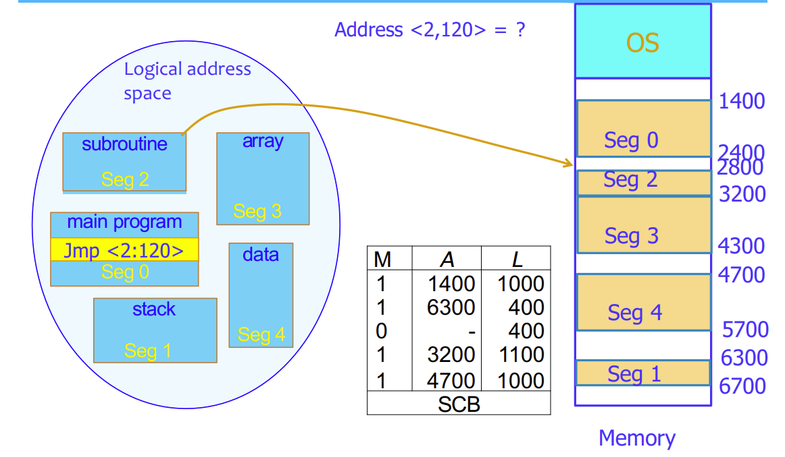

- Here Address<2,120> means accesss section 2 at offset 120 = 2920 in terms of physical address

3. Problem: address conversion

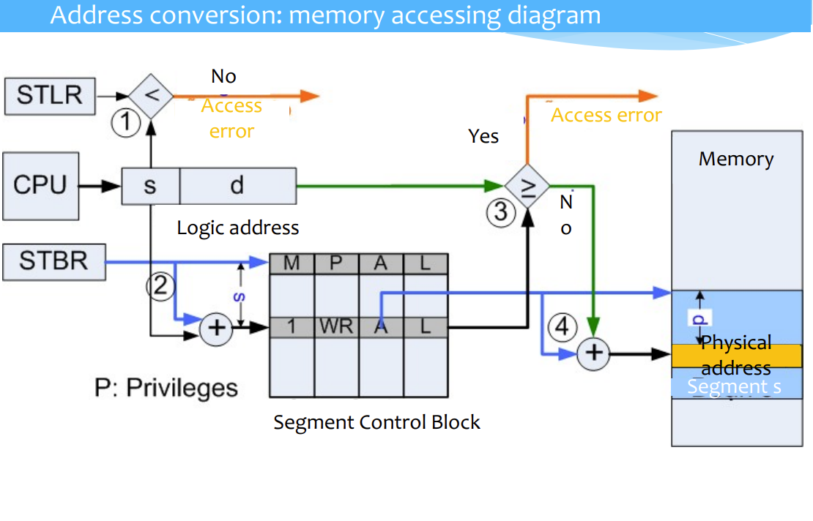

**REMARKS**

- Pros:
    - Module loading diagram does not require user ‘s participation
    - Easy to protect segments

            1. Check memory accessing error
                - Invalid address : more than segment’s length
            2. Check accessing’s property
                - Code segment: read only -> Write into code segment: accessing error
            3. Check the right to access module
                - Add accessing right (user/system) into SCB 

    - Allow segment sharing (Example: Text editor)

- Cons:
- Effectiveness is depended on the program’s structure

- Memory is fragmented because:
    - Memory allocated by methods first fit /best fit... 
    - Hence, require memory rearrangement (relocation, swapping), which is: 
        
            - Easier with the help of SCB 
                - M ← 0 : Segment is not in memory
                - Memory’s area defined by A and L is returned to the free memory management list
    - Selecting which module to bring out is a problem
        
            1. Longest existed module
        
            2. Last recently used module
        
            3. Least frequently used module ⇒ Require media to record number and time that module is accessed

- Solution: allocate memory for equal size segment (page)?

### 2.4 Paging:

1. Rule:

- Physical memory is divided into equal size blocks: page frames
- Physical frame is addressed by number 0, 1, 2, . . . : frame’s physical address
- Frame is the unit for memory allocation
- Program is divided into blocks that have equal size with frame
(pages)
-  When program is executed

        1. Load logical page (from external memory) into page‘s frame

        2. Construct a PCB( Page Control Block) to determine the relation between physical frame and logical page

        3. Each element of PCB is corresponding to a program’s page 

            - Show which frame is holding corresponding page

            - Example PCB[8] = 4 ⇒ ?

        4. Accessing Address is combined of

            - Page’s number (p) : Index in PCB to find page’s base address

            - Displacement in page (d): Combined with base address to find the physical address

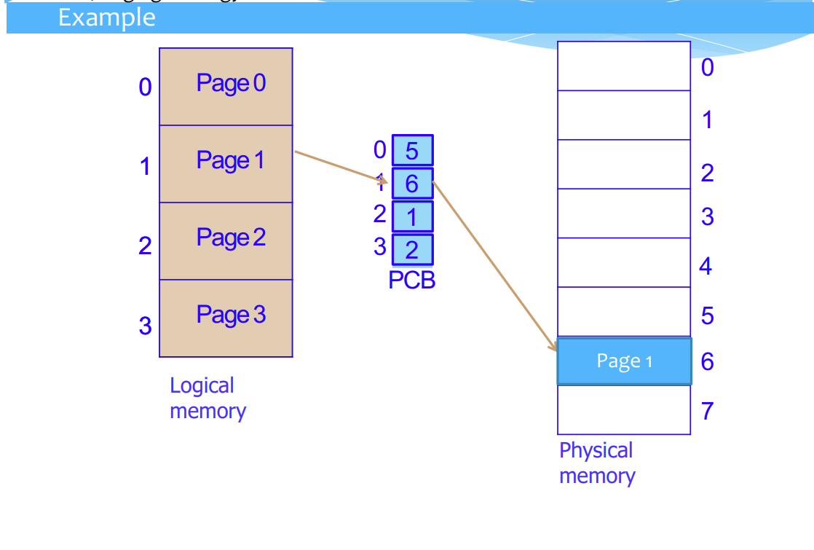

**NOTES** 

- Frame size is always power of 2 
    - Allow connection between frame number and displacement
    - Example: memory is addressed by n bit, frame’s size 2^k frame displacement

- Not necessary to load all page into memory
    
    - Number of frame is limited by memory’s size, number of page can be unlimited
    
    - PCB need Mark filed to know if page is already loaded into memory
        - M = 0 Page is not loaded
        - M = 1 Page is loaded

- Distinguish between paging and segmentation
    - Segmentation
        - Module is depend on program’s structure
    - Paging
         Block’s size is independent from program
        - Block size is depend on the hardware (e.g.: 2^9 → 2^13 bytes)

**REMARKS**

- Number of frame allocated to program 
    - Large => Faster execution speed but parallel factor decrease
    - small => High parallel factor but execution speed slow because page is not inside memory
⇒ Effectiveness is depend on the page loading or page replacing strategy

- Page loading strategy

        1. Load all page: Load all program

        2. Prior loading: predict next page will be used

        3. Load on demand: Only load page when it’s necessary

- Page replacing strategy
    
        1. FIFO First In First Out 
    
        2. LRU Least Recently Used 
    
        3. LFU Least Frequently Used 

        ...

- Pros:

1. Increase memory access speed
    - Access memory 2 times (PCB and required address) 
    - Perform connecting instead of adding operation

2. No external fragmentation phenomenon

3. High parallel factor
    - Only need several program’s page inside memory
    - Program can have any size

4. Easy to perform memory protection
    - Legally access address (not more than page size) 
    - Access property (read/write) 
    - Access right (user/system)

5. Allow sharing page between processes
